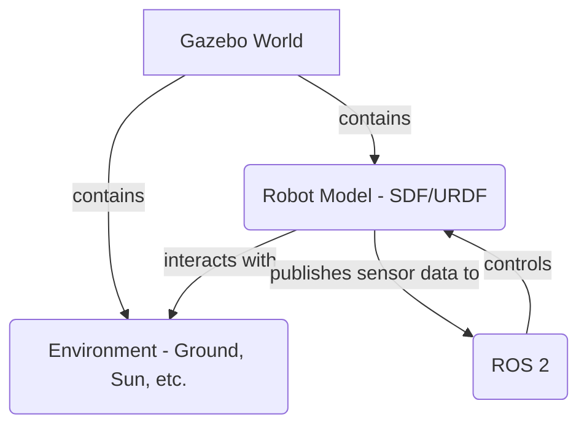

## Introduction to Gazebo

Gazebo is a powerful 3D robotics simulator that allows you to accurately and efficiently simulate populations of robots in complex indoor and outdoor environments. It provides a robust physics engine, high-quality graphics, and programmatic interfaces.

### Key Features:
- **Physics Engine:** Gazebo uses a choice of physics engines (like ODE, Bullet, Simbody, DART) to simulate the dynamics of robots and the environment.
- **Sensor Simulation:** It can simulate a wide variety of sensors, including cameras, LiDAR, IMUs, and GPS.
- **Robot Models:** Gazebo uses the SDF (Simulation Description Format) to define robots and environments. It can also use URDF.
- **ROS Integration:** Gazebo is tightly integrated with ROS, allowing you to use ROS messages, services, and tools to interact with the simulated world.

### Simple World File

Here is an example of a simple world file in SDF, which defines a ground plane and a sun.

```xml
<?xml version="1.0" ?>
<sdf version="1.6">
  <world name="default">
    <include>
      <uri>model://ground_plane</uri>
    </include>
    <include>
      <uri>model://sun</uri>
    </include>
  </world>
</sdf>
```

### Launching Gazebo

You can launch Gazebo with a specific world file from the command line:

```bash
gazebo --verbose my_world.world
```

Or, using a ROS 2 launch file:

```python
from launch import LaunchDescription
from launch.actions import ExecuteProcess

def generate_launch_description():
    return LaunchDescription([
        ExecuteProcess(
            cmd=['gazebo', '--verbose', '-s', 'libgazebo_ros_init.so', '-s', 'libgazebo_ros_factory.so', 'my_world.world'],
            output='screen'
        )
    ])
```

### Simple Diagram


