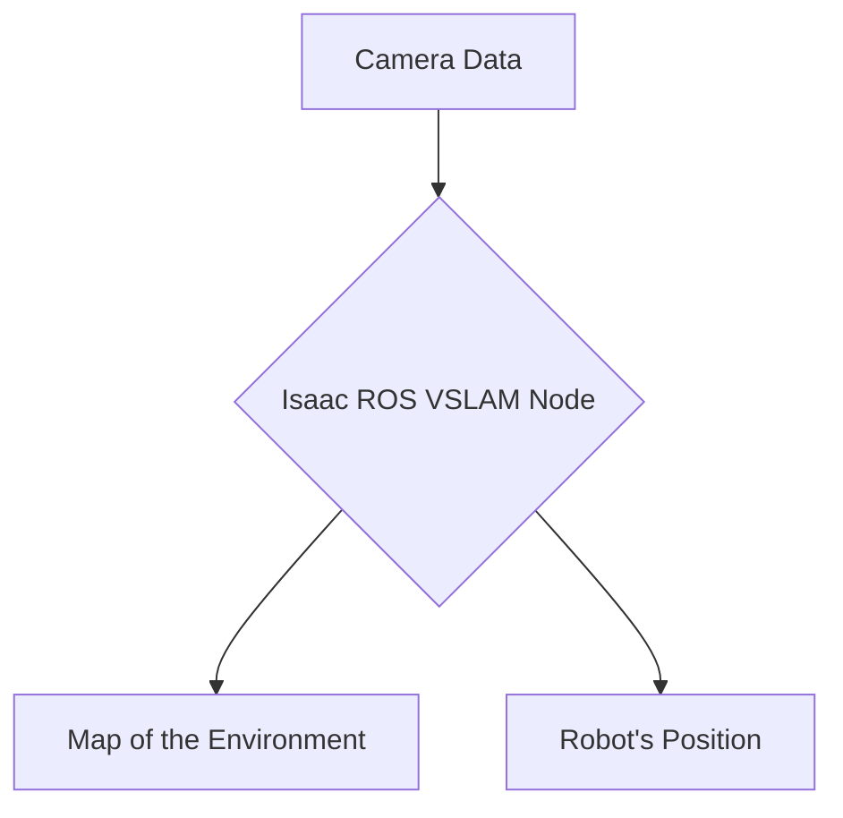

import {useEffect} from 'react';

## 🚀 Chapter 2: Isaac ROS

Isaac ROS is a collection of hardware-accelerated packages for the Robot Operating System (ROS) 2. These packages are optimized for NVIDIA's Jetson platform and GPUs, providing a significant performance boost for common robotics tasks like perception, navigation, and manipulation.

### Key Features 🌟

-   **Hardware Acceleration:** Leverages NVIDIA GPUs and dedicated hardware accelerators on Jetson to speed up computations, freeing up the CPU for other tasks.
-   **VSLAM (Visual Simultaneous Localization and Mapping):** Isaac ROS provides a high-performance VSLAM package that allows a robot to build a map of its environment and track its own position within that map using camera data. 🗺️
-   **Navigation and Perception:** Includes a suite of packages for tasks like stereo depth estimation, object detection, and AprilTag detection.
-   **NITROS (NVIDIA Isaac Transport for ROS):** An optimized transport layer that significantly improves the performance of message passing between ROS nodes, especially for large data like images.

### Simple Diagram of VSLAM

Here is a simple diagram illustrating the VSLAM process:

### Beginner-Friendly Explanation

Imagine you are in a room you've never seen before, and you need to draw a map of it while also keeping track of where you are on that map. This is what VSLAM does for a robot. The Isaac ROS VSLAM package is like giving the robot a super-fast brain (the GPU) to do this process very quickly and accurately, using only what it sees through its cameras. 📸

