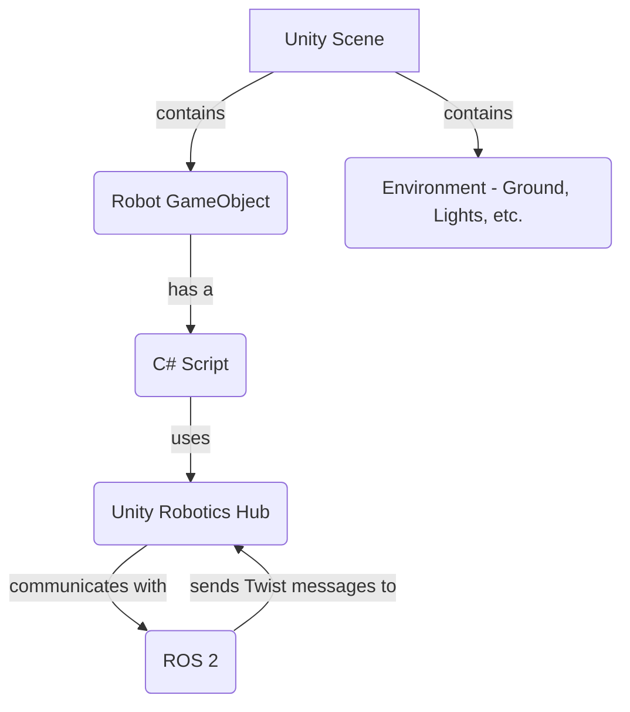

## Introduction to Unity for Robotics

Unity is a popular real-time 3D development platform, widely used for creating games and interactive experiences. With the introduction of the [Unity Robotics Hub](https://github.com/Unity-Technologies/Unity-Robotics-Hub), it has become a powerful tool for robotics simulation.

### Key Features:
- **High-Fidelity Graphics:** Unity's advanced rendering engine allows for the creation of visually realistic simulation environments.
- **Physics Engine:** Unity's built-in physics engine (NVIDIA PhysX) can be used for simulating rigid body dynamics.
- **C# Scripting:** The entire simulation logic is controlled through C# scripts, offering a powerful and flexible development environment.
- **ROS Integration:** The Unity Robotics Hub provides packages for integrating with ROS 2, enabling communication between your Unity simulation and ROS nodes.

### Setting up a Simple Scene

1.  **Install Unity Hub** and a recent version of the Unity Editor.
2.  **Create a new 3D project.**
3.  **Import the Unity Robotics Hub packages**, specifically the `ROS-TCP-Connector`.
4.  **Create a simple scene** with a "Ground" plane and a "Robot" cube.

### Simple C# Script for Robot Control

Here is a simple C# script that can be attached to the "Robot" cube to move it based on ROS 2 messages.

```csharp
using UnityEngine;
using Unity.Robotics.ROSTCPConnector;
using RosMessageTypes.Geometry;

public class RobotController : MonoBehaviour
{
    void Start()
    {
        ROSConnection.GetOrCreateInstance().Subscribe<TwistMsg>("cmd_vel", MoveRobot);
    }

    void MoveRobot(TwistMsg twistMsg)
    {
        // Simple movement based on linear x velocity
        transform.Translate(Vector3.forward * (float)twistMsg.linear.x * Time.deltaTime);
        // Simple rotation based on angular z velocity
        transform.Rotate(Vector3.up, -(float)twistMsg.angular.z * Time.deltaTime * Mathf.Rad2Deg);
    }
}
```

This script subscribes to the `/cmd_vel` topic and moves the robot according to the received `Twist` message.

### Simple Diagram


